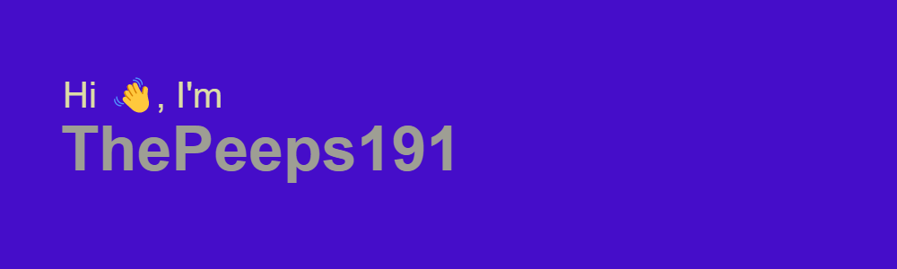

<!------>

<!------>

<h1>Hey There! </h1>
<!---</h1>--->

Hi! I am a mostly self-taught middle-school programmer and started programming in Grade 2/3 with Python. I'm currently getting better at C++ and competitive programming! 😄 You can also check out my portfolio website <a href="https://thepeeps191.github.io">here</a>.

My main languages are Python and C++, but I can use HTML, JavaScript, and CSS in web dev. I also know C (from C++) and Go. I'm also learning Unity for some game development on the side but currently taking a break from game development to get better at competitive programming.

Find a complete list of my skills <a href="#skills">below</a>.

<b>Edit: </b>I'm taking a short break from GitHub to practice for competitive programming, but I'm planning to get more active now!

#⚡Recent Github Activity
<!--START_SECTION:activity-->

<!---         --->

# Github Stats

<!---

--->

# Skills

<!------>
               
<!---img alt="Watching Youtube" src="https://img.shields.io/badge/watching%20youtube-red.svg?style=for-the-badge&logo=youtube&Color=white" />  --->
# Projects

My main project(s) are:
<ul>
  <li><a href="https://github.com/ThePeeps191/dmoj-solutions" target="_blank">DMOJ Solutions</a></li>
  <li><a href="https://github.com/ThePeeps191/online-judge-solutions" target="_blank">Online Judge Solutions</a></li>
  <li>All I really practice is for CCC (Canadian Computing Competition) and C++ practice so this is really all I do right now</li>
</ul>

# What I Like In Programming
<ul>
  <li>Web Dev!</li>
  <li>Game Dev!</li>
  <li>Competitive Programming</li>
  <li>Random Projects</li>
</ul>

# StackOverflow Profile

# Contact

Send me an email at <a href="mailto:wang.da@wcs-g.com">wang.da@wcs-g.com</a>

# Portfolio

Find my portfolio website at <a href="https://thepeeps191.github.io">https://thepeeps191.github.io</a>
