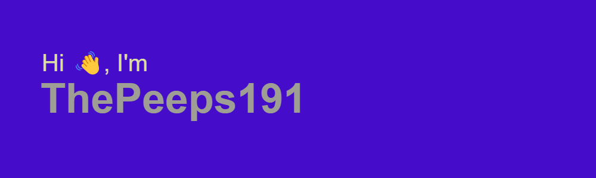

<!------>

<!------>

<h1>Hey There! </h1>
<!---</h1>--->

Hi! I am a software developer and Full IB student at Sir Winston Churchill High School. I've been coding for over half of my life (8+ years!!) and have strong experience with Python, C++, and HTML/CSS/Javascript in a plethora of applications including full stack development, machine learning + AI research, and competitive programming.
- You can check out my portfolio website <a href="https://dannywang.dev">here</a>.
- <a href="https://dannywang.dev/dannywang_resume.pdf">View My Resume</a>
- I'm always open to collaboration and new opportunities to learn and grow - feel free to <a href="mailto:dannywang930@gmail.com">contact me</a>.

Find a general list of my skills <a href="#skills">below</a>.

<!---         --->

<!--# Github Stats

-->

<!---

--->

# Skills

<!------>
               
<!---img alt="Watching Youtube" src="https://img.shields.io/badge/watching%20youtube-red.svg?style=for-the-badge&logo=youtube&Color=white" />  --->
# Projects

Currently, I'm working on:
<ul>
  <li><a href="https://github.com/Tensorbit-Labs/tensorbit-core" target="_blank">Tensorbit Core</a></li>
  <li><a href="https://github.com/ThePeeps191/cosine-similarity-distillation" target="_blank">Cosine Similarity Distillation</a></li>
  <li>Competitive Programming with the goal of qualifying for the IOI</li>
  <li>Competitive Math with the goal of qualifying for the CMO and USAMO</li>
</ul>

<!--### Past Projects
<ul>
  <li><a href="https://learnmonkey.github.io/" target="_blank">Learnmonkey</a></li>
</ul>-->

<!--# What I Like In Programming
<ul>
  <li>Competitive Programming</li>
  <li>Machine Learning & AI Development</li>
  <li>Web Dev!</li>
  <li>Game Dev!</li>
</ul>-->

<!--# StackOverflow Profile
-->
# Contact

Send me an email at <a href="mailto:dannywang930@gmail.com">dannywang930@gmail.com</a>

# Website

Find my portfolio website at <a href="https://dannywang.dev">https://dannywang.dev</a>

